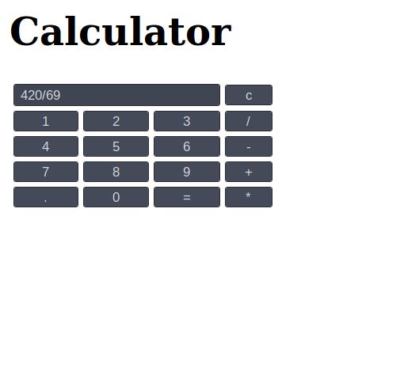

# Vanilla Javascript


#### Introduction:
VanillaJS is a term for library/framework free javascript. 

Its sometimes ironically referred to as a library, as a joke for people who could be seen as mindlessly using different frameworks.

Here's the [official webisite of Vanilla JS]( http://vanilla-js.com/). (Don't bother clicking on the link)

# Why Javascript?:
In fact, there are no many reasons why you should learn JavaScript, that its appeal is obvious:<br> **If programming languages were people, JavaScript would be the *sexy one*.**
- You can get started using JavaScript right now.

    > JavaScript comes installed on every modern web browser, so you can LITERALLY start programming in JavaScript this very second on the very browser that you are using to read this article. If you’re using Google Chrome, for instance, just go to the “View” menu, click on the “Developer” sub-menu, and you’ll see an option to open a JavaScript console. No muss, no fuss.
 - JavaScript can be used to make sites pretty and to build crazy fast servers.

    >It’s not just that JavaScript is so easy to get started with, it’s also that when you DO start using it there is so much it can be used for. Part of what makes JavaScript versatile is that you can use it for front-end AND back-end development. If you’re wondering what that is, front-end development is the work that goes into building the parts of a website users see and interact with, while back-end development is the work that happens “under the hood”—building and managing the servers and databases that power websites behind the scenes. This means two important things for you:


## **And no, it has nothing to do with Java and no prior knowledge of Java is required.**


A decade back, it was just used to annoy people on internet.

 

### Now it's much more than that, it has something for everyone.
 

 # >1.Create your first javascript program

Javascript requires an interpreter to execute the code. Every web browser has its own Javascript engine which acts as an interpreter, each with a different name.

>Chrome: V8 engine
>
>Firefox: SpiderMonkey
>
>Internet Explorer/Edge: Chakra

## >1.1.Let's create a html file that gives an alert. 

**1.Open a blank text file in any text editor with its extension as ".html".**

>eg. helloWorld.html

**2.Type the following code**

```
    <!DOCTYPE html>
    <html>
        <head>
            <script>
                alert("Hello World")
            </script>
        <\head>
        <body>
            Just a basic website.
        <\body>
    <\html>

```

**3.Save the file and open it in any browser**

This should be the output:


You should see a dialog box with the text "Hello World".

*Cool, you just ran your first js script!!*

# 2.Let's create a cool calculator using Javascript!

But first there are few things you should know


## >2.0.1.Statements

Statements are syntax constructs and commands that perform actions.</br>
We’ve already seen a statement, alert('Hello, world!'), which shows the message “Hello, world!”.

We can have as many statements in our code as we want. Statements can be separated with a semicolon.
```
alert("Hello");
alert("World");
```
Semi colons are optional in Javascript.</br>
This works too:
```
alert("Hello ")
alert("World)
```
Both give the same output which is <br>
> "Hello World".

## >2.0.2.Comments
It's necessary to add comments in your js programs as the complexity keeps on growing.
To add a coment  use:
> // This is a comment in js

It also allows multi line comments:
```
/*This 
is
a multi
line comment
*/
``` 
## >2.0.3.Datatypes in JS
There are seven basic data types in JavaScript. But we need not worry about them as JS is __"dynamicaly typed"__ and the variables we define are not bound to any of them.<br>

To declare a variable we use var or let.
> var has a block scope whereas let has function scope.

An example:
```
let a=10 //declaring a variable which stores a number 
a=12.465 //we assign a float number to predefined a
```
The above code will not give you an error.

### >2.0.3.1.Objects in JS
Object is the most important datatype in JS.
They are used to store keyed collections of various data and more complex entities.<br>
__In JavaScript, objects penetrate almost every aspect of the language. So we must understand them first before going in-depth anywhere else.__

Declaring an object.
```
let obj={
    name:"Vishnu",
    age:20
}
```
Objects in JS are similar to Dictionary in Python. They are basically storing key-value pairs.

To access values we use dot notation: _objectName.key_.
So if I had to access my age from the object, I could just
>alert(obj.name)

For more info [click here](https://javascript.info/object)

## >2.0.4.Functions
Quite often we need to perform a similar action in many places of the script.

For example, we need to show a nice-looking message when a visitor logs in, logs out and maybe somewhere else.

Functions are the main “building blocks” of the program. They allow the code to be called many times without repetition.

Function declaration in JS:
```
function hello(){
    alert("Hello,This is a function")
    return 1 //Optional
```
__Note that "function" is a keyword and must be used before every function declaration__<br>
And to call a function we,
```
hello()
let temp=hello() //if return is used   
```

## >2.0.5.Event Handling in JS
JavaScript's interaction with HTML is handled through events that occur when the user or the browser manipulates a page.

When the page loads, it is called an event. When the user clicks a button, that click too is an event. Other examples include events like pressing any key, closing a window, resizing a window, etc.

Developers can use these events to execute JavaScript coded responses, which cause buttons to close windows, messages to be displayed to users, data to be validated, and virtually any other type of response imaginable.

Events are a part of the Document Object Model (DOM) Level 3 and every HTML element contains a set of events which can trigger JavaScript Code.

For example in this project we'll make use of onClick event of a button which needless to say is triggered when you click on a button.
We can call a function which gets executed when the button is pressed.<br>
Here the function called is sayHello() which gives an alert.
```
<html>
    <head>
        <script>
            function sayHello(){
                alert("Henlo Hooman!")
            }
        </script>
    </head>
    <body>
        <button onClick="sayHello()">Click here</button>
    </body>
</html>
```

This is what the above webpage looks:


On clicking the button:


There are a lot of events associated with button, some of them are- onSubmit, onHover, onMouseIn,etc <br>
For more info [click here](https://www.tutorialspoint.com/javascript/javascript_events.htm)


## >2.0.6.Javascript DOM
DOM is short for __Document Object Model__. <br>
According to DOM, every tag inside a HTML document is an object and can be used accessed using Javascript.<br>
\> For example let's explore the DOM of this document:
```
<!DOCTYPE HTML>
<html>
<head>
  <title>About elks</title>
</head>
<body>
  The truth about elks.
</body>
</html>
```
The DOM represents HTML as a tree structure of tags. Here’s how it looks:


Tags are called element nodes (or just elements). Nested tags become children of the enclosing ones. As a result we have a tree of elements: <html> is at the root, then <head> and <body> are its children, etc.

In this tutorial we'll make use of method geteElementById()

### >2.0.6.1.DOM | getElementById()
We can access anything inside a pair of tags by giving it a unique "id" which is a parameter and calling it using getElementById method.

```
<h1 id="heading">
```


This function is widely used in web designing to change the value of any particular element or get the particular element in response to a user interaction in the webpage.

For example to access the color of a element we use:
>getElementById("_ElementID_").style.color;

Or to access the value of the element we use :
>getElementById("_ElementID_").value;
 
 We can also make use of event handlers to make our page more dynamic:
 
 ```
 <html>
    <head>
        <script>
            function changeColor(){
                document.getElementById("heading").style.color="red"
                <!-- Here we access the color and change it into red -->
            }
        </script>
    </head>
    <body>
        <h1 id="heading">Hello There!</h1>
        <button onClick="changeColor()">Click here to change color</button>
    </body>
</html>

```

Here's what the above html page looks like:


After cliking the button:


For more info [click here](https://www.w3schools.com/jsref/dom_obj_all.asp)


 ### __Okay, that should be enough!!__

 # >2.1.Get Started
 Here's how our calculator is supposed to look like:
 
 

 ## >2.1.1.The basic Html page

The above layout we require can easily be done in html using Table.
For info on table [click here](https://www.tutorialrepublic.com/html-tutorial/html-tables.php)<br>
Note that the text space should be stretched over three columns.<br>
Here's the code for just the layout:
```
<html>
    <head>
    </head>
    <body> 
      <h1> Calculator</h1> 
         <tr> 
            <td colspan="3"><input type="text" id="result"/></td> 
            <td><input type="button" value="c"/> </td> 
         </tr> 
         <tr> 
            <!-- create button and assign value to each button -->
            <td><input type="button" value="1" /> </td> 
            <td><input type="button" value="2" /> </td> 
            <td><input type="button" value="3" /> </td> 
            <td><input type="button" value="/" /> </td> 
         </tr> 
         <tr> 
            <td><input type="button" value="4" /> </td> 
            <td><input type="button" value="5" /> </td> 
            <td><input type="button" value="6" /> </td> 
            <td><input type="button" value="-" /> </td> 
         </tr> 
         <tr> 
            <td><input type="button" value="7" /> </td> 
            <td><input type="button" value="8" /> </td> 
            <td><input type="button" value="9" /> </td> 
            <td><input type="button" value="+" /> </td> 
         </tr> 
         <tr> 
            <td><input type="button" value="." /> </td> 
            <td><input type="button" value="0" /> </td> 
            <td><input type="button" value="=" /> </td> 
            <td><input type="button" value="*" /> </td> 
         </tr> 
      </table> 
   </body> 
</html>    


```
Here's the basic layout:


Cool! We're half way there. Now we need to handle each button press and show the corresponding number in the text area.

## >2.1.2. Button Click Handling

Let's create a call event on clicking each button and we pass its value to a function dis() which displays the number:
```
<input type="button" value="1" onclick="dis('1')"/>
```
We can extend it to all the buttons.

And now let's create the function which handles the event call which is dis():
```
function dis(val){ 
              document.getElementById("result").value+=val 
} 
```

This function appends each number which is pressed to the text area.

We also need a function which clears the screen on clicking the 'C' button:

```
function clr() { 
              document.getElementById("result").value = "" 
}
```

Finally, we need to add a function which evaluates the expression and gives us the result on clicking "=" button.<br>
Luckily for us JS has a built-in function for that called eval(), we can use this for our calculator and get the result without breaking a sweat!

```
function solve() { 
    let x = document.getElementById("result").value 
    let y = eval(x) 
    document.getElementById("result").value = y 
} 

```
That's it!
```
   
<html> 
    <head> 
       <script> 
          //function that display value 
          function dis(val) 
          { 
              document.getElementById("result").value+=val 
          } 
            
          //function that evaluates the digit and return result 
          function solve() 
          { 
              let x = document.getElementById("result").value 
              let y = eval(x) 
              document.getElementById("result").value = y 
          } 
            
          //function that clear the display 
          function clr() 
          { 
              document.getElementById("result").value = "" 
          } 

       
    </head> 
    <!-- create table -->
    <body> 
        <h1>Calculator</h1> 
       <table > 
          <tr> 
             <td colspan="3"><input type="text" id="result"/></td> 
             <!-- clr() function will call clr to clear all value -->
             <td><input type="button" value="c" onclick="clr()"/> </td> 
          </tr> 
          <tr> 
             <!-- create button and assign value to each button -->
             <!-- dis("1") will call function dis to display value -->
             <td><input type="button" value="1" onclick="dis('1')"/> </td> 
             <td><input type="button" value="2" onclick="dis('2')"/> </td> 
             <td><input type="button" value="3" onclick="dis('3')"/> </td> 
             <td><input type="button" value="/" onclick="dis('/')"/> </td> 
          </tr> 
          <tr> 
             <td><input type="button" value="4" onclick="dis('4')"/> </td> 
             <td><input type="button" value="5" onclick="dis('5')"/> </td> 
             <td><input type="button" value="6" onclick="dis('6')"/> </td> 
             <td><input type="button" value="-" onclick="dis('-')"/> </td> 
          </tr> 
          <tr> 
             <td><input type="button" value="7" onclick="dis('7')"/> </td> 
             <td><input type="button" value="8" onclick="dis('8')"/> </td> 
             <td><input type="button" value="9" onclick="dis('9')"/> </td> 
             <td><input type="button" value="+" onclick="dis('+')"/> </td> 
          </tr> 
          <tr> 
             <td><input type="button" value="." onclick="dis('.')"/> </td> 
             <td><input type="button" value="0" onclick="dis('0')"/> </td> 
             <!-- solve function call function solve to evaluate value -->
             <td><input type="button" value="=" onclick="solve()"/> </td> 
             <td><input type="button" value="*" onclick="dis('*')"/> </td> 
          </tr> 
       </table> 
    </body> 
 </html>    
 ```
Now let's see the result:


_Yay! It works_
But we can see that some of the buttons are not properly aligned, we can easily fix that using stylesheet.

```
<style>
input[type="button"] { 
        width:100% 
    } 
</style> 
```
Here's the final code:

```
   
<html> 
    <head> 
       <script> 
          //function that display value 
          function dis(val) 
          { 
              document.getElementById("result").value+=val 
          } 
            
          //function that evaluates the digit and return result 
          function solve() 
          { 
              let x = document.getElementById("result").value 
              let y = eval(x) 
              document.getElementById("result").value = y 
          } 
            
          //function that clear the display 
          function clr() 
          { 
              document.getElementById("result").value = "" 
          } 
       </script> 
       <!-- for styling -->
       <style>
        input[type="button"] { 
            width:100% 
    } 
</style> 
       
    </head> 
    <!-- create table -->
    <body> 
        <h1>Calculator</h1> 
       <table > 
          <tr> 
             <td colspan="3"><input type="text" id="result"/></td> 
             <!-- clr() function will call clr to clear all value -->
             <td><input type="button" value="c" onclick="clr()"/> </td> 
          </tr> 
          <tr> 
             <!-- create button and assign value to each button -->
             <!-- dis("1") will call function dis to display value -->
             <td><input type="button" value="1" onclick="dis('1')"/> </td> 
             <td><input type="button" value="2" onclick="dis('2')"/> </td> 
             <td><input type="button" value="3" onclick="dis('3')"/> </td> 
             <td><input type="button" value="/" onclick="dis('/')"/> </td> 
          </tr> 
          <tr> 
             <td><input type="button" value="4" onclick="dis('4')"/> </td> 
             <td><input type="button" value="5" onclick="dis('5')"/> </td> 
             <td><input type="button" value="6" onclick="dis('6')"/> </td> 
             <td><input type="button" value="-" onclick="dis('-')"/> </td> 
          </tr> 
          <tr> 
             <td><input type="button" value="7" onclick="dis('7')"/> </td> 
             <td><input type="button" value="8" onclick="dis('8')"/> </td> 
             <td><input type="button" value="9" onclick="dis('9')"/> </td> 
             <td><input type="button" value="+" onclick="dis('+')"/> </td> 
          </tr> 
          <tr> 
             <td><input type="button" value="." onclick="dis('.')"/> </td> 
             <td><input type="button" value="0" onclick="dis('0')"/> </td> 
             <!-- solve function call function solve to evaluate value -->
             <td><input type="button" value="=" onclick="solve()"/> </td> 
             <td><input type="button" value="*" onclick="dis('*')"/> </td> 
          </tr> 
       </table> 
    </body> 
 </html>    
 ```

 And this is what our calculator looks like!

 

# >3.Wrapping Up
### For further refrences:

[A handy site to master JS](www.javascript.info)

[For refrences from Official docs](https://developer.mozilla.org/en-US/docs/Web/JavaScript)


